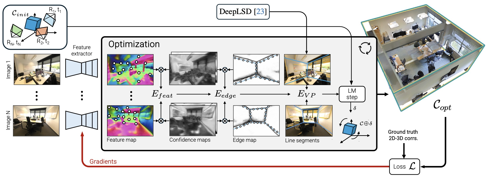

# PixCuboid



We introduce PixCuboid, an optimization-based approach for cuboid-shaped room layout estimation, which is based on multi-view alignment of dense deep features.

This repository contains the official implementation of the paper **PixCuboid: Room Layout Estimation from Multi-view Featuremetric Alignment**, to be presented at the ICCV 2025 Workshop on Large Scale Cross Device Localization.

Project page: https://ghanning.github.io/PixCuboid/

## News

- 2026-08-03: Check out our follow-up method [PolyLayout](https://github.com/ghanning/PolyLayout), which extends PixCuboid to multi-room Manhattan layouts.

- 2025-10-20: PixCuboid was awarded the best student paper award at the CroCoDL workshop.

- 2025-08-05: Initial code release.

## Code base

PixCuboid is built upon the excellent [PixLoc](https://github.com/cvg/pixloc) code base. The PixLoc `master` branch is available in this repository under the name `pixloc`.

## Installation

Install PixCuboid in editable mode as follows:

```bash
git clone https://github.com/ghanning/PixCuboid.git
cd PixCuboid/
virtualenv venv
source venv/bin/activate
pip install -e .
```

Running the demo notebooks requires some extra dependencies that can be installed with:

```bash
pip install -e .[extra]
```

## Datasets

Download the [ScanNet++](https://kaldir.vc.in.tum.de/scannetpp/) and [2D-3D-Semantics](https://github.com/alexsax/2D-3D-Semantics) datasets from their respective web sites and unpack into a subdirectory named "datasets". The expected directory structure is shown below.

```
.
└── datasets
    ├── 2d3ds
    │   ├── area_1
    │   ├── area_2
    │   ├── area_3
    │   ├── area_4
    │   ├── area_5a
    │   ├── area_5b
    │   └── area_6
    └── scannetpp
        ├── data
        ├── metadata
        └── splits
```

**Note**: We only use ScanNet++ to train PixCuboid, but provide code to run the room layout estimation also on 2D-3D-Semantics.

## Preprocessing

### Undistorted DSLR images

~Use the [ScanNet++ Toolbox](https://github.com/scannetpp/scannetpp) to undistort the DSLR fisheye images by following the instructions [here](https://github.com/scannetpp/scannetpp?tab=readme-ov-file#undistortion-convert-fisheye-images-to-pinhole-with-opencv).~

**Note**: As of April 30, 2025, undistorted DSLR images are included in the ScanNet++ dataset and this step can thus be skipped.

### Depth maps

Render depth maps for the undistorted DSLR images using the `render-undistorted` branch in [my fork](https://github.com/ghanning/scannetpp) of the ScanNet++ Toolbox as described [here](https://github.com/scannetpp/scannetpp?tab=readme-ov-file#render-depth-for-dslr-and-iphone), but set `render_undistorted` to `True`.

### 2D-3D correspondences

Run our preprocessing script to find the 2D-3D point correspondences used in training:

```bash
python -m pixloc.pixlib.preprocess_scannetpp
```

### Perspective images for 2D-3D-Semantics (optional)

Split the panorama images into perspective views as detailed [here](https://github.com/ghanning/MultiViewRoomLayout?tab=readme-ov-file#perspective-images-2d-3d-semantics).

### Line segments (optional)

While line segments are not required to train PixCuboid they improve its performance at inference time. To extract line segments with [DeepLSD](https://github.com/cvg/DeepLSD) first install it with

```bash
pip install -e .[deeplsd]
```

then download the pre-trained weights

```bash
mkdir weights
wget https://cvg-data.inf.ethz.ch/DeepLSD/deeplsd_md.tar -O weights/deeplsd_md.tar
```

and run the extraction for ScanNet++ and 2D-3D-Semantics:

```bash
./scripts/line_segments_scannetpp.sh
./scripts/line_segments_2d3ds.sh
```

Alternatively, you can download the line segments for ScanNet++ from [here](https://drive.google.com/file/d/1HUJrkj8YE7Z8_8roA9_pE1Ox_VNwspD4/view?usp=sharing) (665 MiB) and unpack them with the command

```bash
unzip line_segments_scannetpp.zip -d datasets/scannetpp
```

Similarly, the line segments for 2D-3D-Semantics are available [here](https://drive.google.com/file/d/1mP744R2uNAnHNpKCMosrd6tNCxOTW2dt/view?usp=sharing) (8 MiB). Unzip with

```bash
unzip line_segments_2d3ds.zip -d datasets/2d3ds
```

## Training

Training is done in two stages. First the edge detector is pre-trained by running:

```bash
python -m pixloc.pixlib.train --conf pixloc/pixlib/configs/pretrain_pixcuboid_scannetpp.yaml pixcuboid_scannetpp_pretrain
```

Next the full network is trained, with weights initialized from the previous stage:

```bash
python -m pixloc.pixlib.train --conf pixloc/pixlib/configs/train_pixcuboid_scannetpp.yaml pixcuboid_scannetpp train.load_experiment=pixcuboid_scannetpp_pretrain
```

*Tip*: Pass the `--wandb_project <PROJECT>` argument to the training script to log the results to [Weights & Biases](https://wandb.ai).

## Evaluation

We supply a script to run PixCuboid on each image tuple (ScanNet++) or space (2D-3D-Semantics) and output the room layout predictions to a JSON file.

### ScanNet++

```bash
python -m pixloc.run_PixCuboid --experiment pixcuboid_scannetpp --conf pixloc/pixlib/configs/eval_pixcuboid_scannetpp.yaml --split {train,val,test} --output OUTPUT
```

### 2D-3D-Semantics

```bash
python -m pixloc.run_PixCuboid --experiment pixcuboid_scannetpp --conf pixloc/pixlib/configs/eval_pixcuboid_2d3ds.yaml --split test --output OUTPUT
```

The resulting predictions can be evaluated using the code in the [MultiViewRoomLayout](https://github.com/ghanning/MultiViewRoomLayout) repository.

## Pre-trained weights

Pre-trained weights for a model trained on ScanNet++ as outlined above can be found [here](https://drive.google.com/file/d/1_w1qNv7hHn7ozXaQx1tqOb0BtzWJbFPM/view?usp=share_link) (317 MiB). Extract the checkpoint with

```bash
mkdir -p outputs/training && unzip pixcuboid_scannetpp.zip -d outputs/training
```

## Demo

Try out PixCuboid on ScanNet++ and 2D-3D-Semantic with the Jupyter notebook [demo_PixCuboid.ipynb](notebooks/demo_PixCuboid.ipynb).

We show how the method can be applied to your own data (e.g. a set of images from a [COLMAP](https://colmap.github.io/) reconstruction) in the notebook [PixCuboid_COLMAP.ipynb](notebooks/PixCuboid_COLMAP.ipynb).

## BibTeX citation

Use the BibTeX reference below to cite our work.

```
@inproceedings{hanning2025pixcuboid,
  title={{PixCuboid: Room Layout Estimation from Multi-view Featuremetric Alignment}},
  author={Hanning, Gustav and Åström, Kalle and Larsson, Viktor},
  booktitle={Proceedings of the IEEE/CVF International Conference on Computer Vision (ICCV) Workshops},
  year={2025},
}
```

In addition, please consider citing the PixLoc paper:

```
@inproceedings{sarlin21pixloc,
  title={{Back to the Feature: Learning Robust Camera Localization from Pixels to Pose}},
  author={Paul-Edouard Sarlin and Ajaykumar Unagar and Måns Larsson and Hugo Germain and Carl Toft and Viktor Larsson and Marc Pollefeys and Vincent Lepetit and Lars Hammarstrand and Fredrik Kahl and Torsten Sattler},
  booktitle={CVPR},
  year={2021},
}
```
